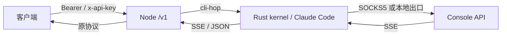
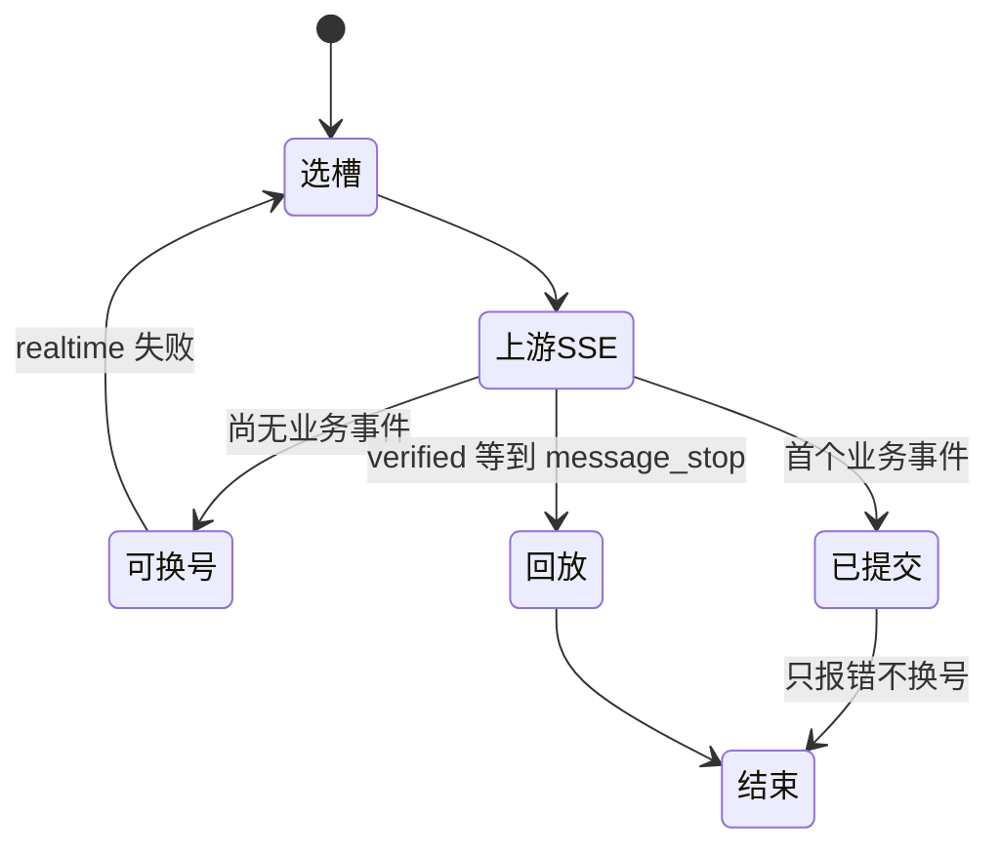

# API 用法

协议口默认本机 `:8787`（生产可用 nginx 反代）。本文只写 **现在代码里的客户端契约**。面板口见 [PANEL_API.md](PANEL_API.md)。出站行为见 [PROTOCOL.md](PROTOCOL.md)。



## 鉴权

| 密钥 | 来源 | 能调 |
|------|------|------|
| Master `VM2API_API_KEY` | 环境变量 | `/v1/*` + `/api/panel/*` + `/admin/*` |
| `sk-vm-…` | 控制台签发 | **只** `/v1/*` |
| 面板会话 | 面板登录 | **只** `/api/panel/*` |

请求头任选其一：

```http
Authorization: Bearer sk-vm-…
x-api-key: sk-vm-…
```

没有密钥 → `401 missing_api_key`。协议密钥调面板 → `403 forbidden`。

## 端点

| 方法 | 路径 | 入站 | 出站给客户端 |
|------|------|------|--------------|
| `POST` | `/v1/messages` 或 `/messages` | Anthropic Messages | Anthropic Messages / SSE |
| `POST` | `/v1/messages/count_tokens` 或 `/messages/count_tokens` | Anthropic count_tokens | Setup/API Key → `{ input_tokens }`；OAuth → 5H/7D（同 `/v1/usage`） |
| `GET` | `/v1/usage` | — | 当前 OAuth 账户 5H/7D（`unit=percent_used`） |
| `POST` | `/v1/chat/completions` 或 `/chat/completions` | OpenAI Chat | OpenAI Chat / SSE |
| `POST` | `/v1/completions` 或 `/completions` | OpenAI Completions | OpenAI Completions |
| `POST` | `/v1/responses` 或 `/responses` | OpenAI Responses | OpenAI Responses |
| `GET` | `/v1/models` | — | 本地模型策略目录 |
| `GET` | `/health` · `/` · `/v1/meta` | 无鉴权 | 能力 / 限制 / 计数 |

上游 hop **永远** `stream: true`。客户端 `stream: true` 收 SSE；`stream: false` 或 `x-kin-delivery: verified` 由网关聚合成 JSON。

别名路径（无 `/v1` 前缀）与上表相同处理函数。

## 公共请求头

| 头 | 作用 |
|----|------|
| `content-type: application/json` | 必填 |
| `x-session-id` / `x-conversation-id` / `x-claude-code-session-id` | sticky 键（见 `routing.sticky`） |
| 交付模式 `verified` | 缓冲到 `message_stop` 再回放 |
| 缓存 TTL `1h` | 出站 cache 默认 1h；`x-kin-cache-ttl: 5m` 可降到 5m |
| 调试开关 | 单请求日志模式 |
| 钉槽（仅 master） | 虚拟机测试 loopback |
| `X-Request-ID` | 原样回写响应头 |

体大小上限默认 128MB（`KIN_MAX_BODY` 可覆盖）。超限在选号之前返回 `413 body_too_large`，不进入号池。

## Messages

```bash
curl -sS http://127.0.0.1:8787/v1/messages \
  -H "Authorization: Bearer $KEY" \
  -H "content-type: application/json" \
  -H "x-session-id: conv-1" \
  -d '{
    "model": "claude-sonnet-5",
    "max_tokens": 128000,
    "messages": [{"role": "user", "content": "hello"}]
  }'
```

必填：`model`、非空 `messages[]`（每条有 `role`，以及 `content` 或 `tool_calls`）。`max_tokens` 可省，缺省填 **128000**。

流式：`"stream": true`，响应 `text/event-stream`，事件与 Anthropic 相同（`message_start` … `message_stop`）。

非官方入站会被改写成配置选定的 persona system 再发给上游；**回包不带改写后的 system**。`persona_preset=official` 保留 billing、identity、调用方 agent prompt（若有）和调用方 system；`persona_preset=official_full` 才固定追加完整 Claude Code agent prompt。非官方 `usage` 按「没有 persona system、没有注入 tools」估算。官方 Claude Code 四闸全过则体不改、usage 不藏。

支持的 Messages 字段原样进入清洗层：`system`、`tools`、`tool_choice`、`thinking`、`output_config`、`metadata`、`stop_sequences`、图片块、`cache_control`。非法 `role` 会洗掉。OpenAI 形态 tools 出现在本口时先转成 Anthropic tools，但仍判非官方。

### Sonnet 5.5 兼容边界

`claude-sonnet-5-5` 不支持原生强制工具调用。Node 沿用 Opus 5.5 策略：`tool_choice=any/tool/required` 转成 `{type:auto}`；指定名称的客户端工具设置 `strict:true`，服务端工具不加该字段。不注入提示词，也不把普通文本伪造成工具调用。**strict 只约束实际工具调用的参数，不保证一定调用或只调用指定工具。** 需要原生强制调用时继续使用支持该能力的模型，例如 `claude-sonnet-5`；其行为不变。

规则覆盖 Messages、Chat Completions、Responses 的出站清洗。`auto` / `none` 保持；不支持的 disabled/enabled thinking 转为 adaptive，保留 display。结构化输出转换保留 `output_config.effort`，已有 `output_config.format` 优先，否则从 `response_format` / `text.format` 合并，cli-hop 与普通出站路径均补齐对象 schema 的 `additionalProperties:false`（不覆盖显式值）。


## Chat Completions

```bash
curl -sS http://127.0.0.1:8787/v1/chat/completions \
  -H "Authorization: Bearer $KEY" \
  -H "content-type: application/json" \
  -d '{
    "model": "claude-sonnet-5",
    "messages": [
      {"role": "system", "content": "你是一个高速收费员。"},
      {"role": "user", "content": "你好呀。"}
    ]
  }'
```

转换（`convert.mjs`）：

| OpenAI | 上游 Messages |
|--------|----------------|
| `messages[].role=system\|developer` | 顶层 `system`；完整 official 模板先放 billing + identity + agent_prompt，再把调用方 system 作为末块 append |
| `tools[].function` | Anthropic `tools[]` |
| `tool_choice=required` | `{type:any}` |
| `tool_choice.function` | `{type:tool,name}` |
| `reasoning_effort` / `reasoning.effort` | `thinking.enabled + budget` |
| `response_format` | `output_config` |
| 图片 `image_url` | Anthropic image 块 |

回包：

```json
{
  "id": "chatcmpl-…",
  "object": "chat.completion",
  "choices": [{
    "index": 0,
    "message": {"role": "assistant", "content": "…", "tool_calls": []},
    "finish_reason": "stop"
  }],
  "usage": {
    "prompt_tokens": 0,
    "completion_tokens": 24,
    "total_tokens": 24,
    "prompt_tokens_details": {"cached_tokens": 0}
  }
}
```

`finish_reason`：`tool_use` → `tool_calls`，`max_tokens` → `length`，`refusal` → `content_filter`。空 refusal 会填 `message.refusal`，避免空白 completion。

流式：`data: {choices:[{delta:{content}}]}`，结束 `data: [DONE]`。

## Completions / Responses

`POST /v1/completions`：`prompt`（字符串或非空数组）必填，转成单条 user Messages。

`POST /v1/responses`：`input` 或 `messages` 必填。回包 `usage.input_tokens_details` 带缓存明细。`stop_reason=refusal` 同样映射 content_filter。

## 模型目录

```bash
curl -sS http://127.0.0.1:8787/v1/models -H "Authorization: Bearer $KEY"
```

读面板持久化的 `model_policy`，**不** hop 槽位 `/v1/models`。未入库的 id → `400`，请求被拒，不上游。别名如 `claude-haiku-4-5` 可解析到带日期的目录项。出站 `model` 去掉 `[1m]` 后缀。

## count_tokens / usage

选当前会用的账户（sticky 仍可调度则用 sticky，否则下一张）。**不写、不拆 sticky。** 按该 VM 凭证分叉：

- Setup Token / Console API Key：hop 官方 Token Counting，`{ input_tokens }`
- 完整 OAuth：不 hop count_tokens，返回与 `GET /v1/usage` 相同的 5H/7D

```bash
curl -sS http://127.0.0.1:8787/v1/messages/count_tokens \
  -H "Authorization: Bearer $KEY" \
  -H "content-type: application/json" \
  -d '{"model":"claude-sonnet-5","messages":[{"role":"user","content":"hi"}]}'
```

```bash
curl -sS http://127.0.0.1:8787/v1/usage -H "Authorization: Bearer $KEY"
```

`GET /v1/usage` 仅完整 OAuth。成功：

```json
{
  "unit": "percent_used",
  "five_hour": { "utilization": 12, "status": "active", "resets_at": "…" },
  "seven_day": { "utilization": 34, "status": "ok", "resets_at": "…" },
  "source": "extra"
}
```

`utilization` 0–100。有 Messages Extra 用 Extra；两窗都空才走一次带缓存的官方 `/api/oauth/usage`（`source=oauth-usage`）。Setup Token 只有 `user:inference` 时官方 usage 会返回 scope 错误；服务端保留失败原因，不把它当吊销/封禁，也不改历史套餐。Console API Key 调 `/v1/usage` → `400 usage_unsupported`。窗缺失为 `null`，不伪装 0%。

## 面板额度探测

`POST /api/panel/probe` 是手动 fresh 探测，默认等同：

```json
{ "hop": true, "force": true }
```

可传 `{ "hop": false }` 只读最近 Messages 响应头缓存；`force:false` 则允许复用 usage cache。返回 `items[]`，每项 `ok:false` 会带 `error`，顶栏按成功/失败分别提示。

套餐判定只认成功且完整的官方 usage：必须有 5h、7d，并能确定 Fable 7d 是否存在；有 Fable 7d 即 Max，没有即 Pro。失败、scope 不足、只有 5h、CLI 文本不完整都不改套餐。未知但有票的账号在面板显示为“待探测/未确认”，不是第三套餐。


## 健康

```bash
curl -sS http://127.0.0.1:8787/health
```

无鉴权。含 `features`、`limitations`、`stats`。能力字面量：`passthrough`、`stream`、`verified-stream`、`protocol-convert`、`go-slot-worker`、`account-pool-failover`、`weighted-round-robin`、`tools`、`client-workspace`、`count_tokens`、`account_usage`。

## 错误

协议口错误体：

```json
{
  "error": {
    "type": "invalid_request_error",
    "code": "missing_field",
    "message": "…",
    "param": "model",
    "request_id": "…"
  }
}
```

| type | 典型 HTTP |
|------|-----------|
| `authentication_error` | 401 |
| `permission_error` | 403 |
| `invalid_request_error` | 400 |
| `rate_limit_error` | 429 |
| `quota_error` | 429 |
| `overloaded_error` | 503 / 529 |
| `timeout_error` | 504；客户端断开 499 |
| `upstream_error` | 401/403/502 |
| `api_error` | 500 |

429 可能带 `retry-after`。恢复备份期间协议口 `503 restore_in_progress`。健康探测短请求在无缓存且 fail-closed 时 `503`。

号池结果分开返回，不互相伪装：

| 情况 | HTTP | code | message |
|---|---|---|---|
| 所有合格执行位都忙，有界等待（或等待队列）用完 | 429 | `pool_overloaded` | 号池负载过高，稍后再试 |
| 没有任何合格账号（未配置、额度 / 凭证 / 模型 / 人工关闭都不合格） | 503 | `pool_unavailable` | 号池当前没有可用账号 |
| 已经执行过、最后一跳失败 | 上游本义 | 上游错误码（如 `incomplete_response`、429、401） | 上游本义 |

`pool_overloaded` 只有在已知恢复时刻（冷却、RPM 窗口、会话窗口到期）时才带 `retry-after`。OpenAI 槽同样如此。续接 `previous_response_id` 的 Responses 请求只能在原 GPT 账号上继续；该账号已不可用时返回 `409 response_not_portable`，请带完整上下文重新发起。

客户端断开不计 SLA、不处罚账号。

### CLI / kernel 故障与取消

已知原因不会再被统一改成 `incomplete_response`。流式与非流式都保留错误码、真实 HTTP 状态和 `retry-after`；已写出业务 SSE 时只结束当前流，不重放。

| code | HTTP | 含义 |
|---|---|---|
| `upstream_network_error` | 502 | 建连 / 代理 / 网络失败，尚未收到上游事件 |
| `upstream_stream_interrupted` | 502 | 上游事件流中断 |
| `upstream_empty_stream` | 502 | 上游没有发出任何事件就结束 |
| `cli_error` / `kernel_error` | 502 | 本地 CLI / 内核失败，不写账号冷却 |
| `kernel_unavailable` | 503 | CLI 正在恢复或恢复预算耗尽；换到可用 VM |
| `upstream_timeout` | 504 | 上游或 job 静默超时 |

上游 400/404、401/403、429、5xx 分别保留 `upstream_invalid_request`、`upstream_auth_error`、`upstream_rate_limit`、`upstream_error`（过载为 `upstream_overloaded` / 529）。一次 native job 只发一次上游请求；CLI 不做隐藏重试、换模型或流式转非流式，重放预算由 Node 统一计数。

客户端取消经内部鉴权的 `POST /internal/v1/cancel {"request_id":"单次 hop ID"}` 传到 CLI。每次执行使用不同 ID；提前到达的取消也阻止后续提交。HTTP 断开是第二条兜底路径。取消不会触发重试、账号处罚或重启；CLI 任务真正结束并返回匹配 `kin_cancel_ack` 前，内核不复用该 slot。取消一个任务不阻塞其他 slot 或探活。

自动恢复由低到高，不能由普通推理请求绕过：

1. Cancel ack 超过 30 秒：只关闭该 slot，最多重发 3 次取消，间隔 30 / 60 / 120 秒；匹配的迟到 ack 恢复该 slot。
2. 共享 CLI 60 秒无输出且有在途任务、job 超时或出现关闭 slot：用 `kin_ping` / `kin_pong` 探测，最多 3 次，间隔 10 秒。正常长请求可回答 pong，不按请求总时长判死。
3. 探活失败、进程退出、stdin 断管 / 写入超过 10 秒、全部 slot 关闭或至少半数关闭且无在途任务：内核只重启 CLI 子进程，10 分钟内最多 3 次，等待 10 / 30 / 60 秒。
4. 内核不可达或 CLI 恢复已耗尽：Node watchdog 才重启容器，1 小时内最多 3 次，每次先等待 1 / 5 / 15 分钟。
5. 容器恢复仍失败：停止自动重启，排除该 VM（粘性与诊断 pin 都不能绕过），经配置的通知渠道告警。观察到内核恢复健康后解除故障；运行中的 cc-node/crag 保留原有不重启例外。

内部 `/internal/health` 暴露 `healthy`、`unhealthy_reason`、`recovering`、`closed_slots`、`cli_restarts`、`ready_slots`、`cli_pid`。`ready_slots=0` 且 CLI 存活是忙，`recovering=true` 是内核自身恢复；二者都不是容器重启理由。旧字段 `wedged_slots` 已移除。


### `502 incomplete_response`

```json
{"error":{"type":"upstream_error","code":"incomplete_response","message":"Assistant hop ended without visible output or stop_reason"}}
```

含义：请求已交给槽内 CLI，既没有明确的错误原因，也没有可见输出（text / tool_use / refusal）或 `stop_reason`。只有 thinking 也算。上一次执行已经结束且尚未向客户端写出时，网关先换到别的空闲 VM 重放，没有空位才回到同一 VM；同一请求在同一 VM 上最多实际执行 3 次（含传输层隐藏重试）。都用完仍不完整，才把这个 502 交回客户端。这一次请求不停调、不写账号冷却，也不因计数重启 CLI。一开始就没有可用账号时，返回 `pool_unavailable`。客户端主动断开是 `client_cancelled`，不是这个错误。诊断钉死在某一个槽时，停在该槽并返回这个错误。

常见原因与处理：

| 现象 | 原因 | 处理 |
|---|---|---|
| 同一个槽的请求**全部**失败，网络 / 超时错误；面板代理探测却是绿的 | 槽容器到宿主机 `kin-egress` 网关被宿主机防火墙拦截（常见于 UFW 入站默认拒绝）。容器内 DNS 和出站 TCP 超时 | 放行 `keg*` 网卡到网关端口的入站，见 [DEPLOY.md「防火墙」](DEPLOY.md#防火墙ufw--firewalld) |
| 偶发，重试后成功 | 上游流中断（新二进制报 `upstream_stream_interrupted`）或模型只返回了 thinking | 尚未提交的请求可重放；同一 VM 最多 3 次 |
| 某个槽持续失败 | slot 取消未结束或共享 CLI 不再响应 | 内核先隔离 slot / 重启 CLI；预算耗尽后 watchdog 才重启容器并最终告警，不需要每次手工重启 |

面板代理探测是从宿主机本机连网关端口，不经过「容器 → 网关」这一跳，所以防火墙拦截时它仍显示正常。确认方法：

```bash
# 在宿主机上，进入出问题的槽容器测 DNS 和出站
docker exec kin-<槽> getent hosts api.anthropic.com
docker exec kin-<槽> curl -sS -o /dev/null -w '%{http_code}\n' --max-time 10 https://api.anthropic.com
```

两条都超时即为防火墙拦截；能解析且返回 HTTP 状态码（如 404）说明出口正常，再查上游和凭证。

## 交付与粘性



- **realtime（默认）**：第一段业务 SSE 写出后不再换账号。
- **verified**：收齐 `message_stop` 再给客户端；不完整则继续换号。
- sticky：同一会话（`x-session-id` 等键）在终态成功后绑槽。绑定是偏好，不是过滤：绑定槽忙（并发、RPM、执行位满、未知 429 短冷却）时，这一轮借用同平台别的空闲合格槽，绑定不动，下一轮仍回原槽；额度 / 凭证 / 暂停等确定失效才把会话连同会话窗口迁走。
- 重试预算：每个 VM 每请求最多 3 次实际执行；准入竞争失败不算一次执行。`failover.max_total_attempts` / `max_account_switches` 用完后只再尝试本请求还没试过的 VM，直到 `total_retry_deadline_ms`。
- 子请求：带显式 `parent_session_id` / `root_session_id` 且父会话在本地已有绑定时，子请求计入父会话的会话窗口，不新占 `max_sessions`；每个并行子请求仍各占一个执行位、并发与 RPM。没有显式父子字段时，同设备的新会话不会被当作子请求。
- Claude Code 子 agent：请求头带 `x-claude-code-agent-id` 时，按上一条的子请求处理，父会话是 `metadata.user_id.session_id`，子会话 ID 由它和 agent ID 派生。每个 agent 单独排队、单独占执行位，落在父会话同一 VM 的任意空闲执行位，不等父会话当前这一轮。
- 裸 429（没有 5h/7d 头、没有套餐文案）不按模型名定范围：当前执行单元短暂让位并触发一次 `/usage` 探测，由真实用量决定是否是账号额度。上游文本点名模型的才按模型冷却，每分钟限流按 RPM 短冷却。

## 用量回包

非官方：客户端看到的 `input_tokens` / `cache_*` 扣掉网关注入的 persona system 块和 server tools。调用方自己的 prompt / tools 仍计入。官方 Claude Code 不扣。

`request_logs` 与计费始终用上游真数（含 cache 5m/1h）。

## 最小联调清单

1. `GET /health` 200  
2. `GET /v1/models` 带密钥，看到策略目录  
3. `POST /v1/messages` 非流 `hello`  
4. 同请求加 `"stream": true`，能收到 `message_stop`  
5. `POST /v1/chat/completions` 一条 system + user  
6. 带 `x-session-id` 连打两轮，日志 attempt 落同一槽（该槽仍可用时）
